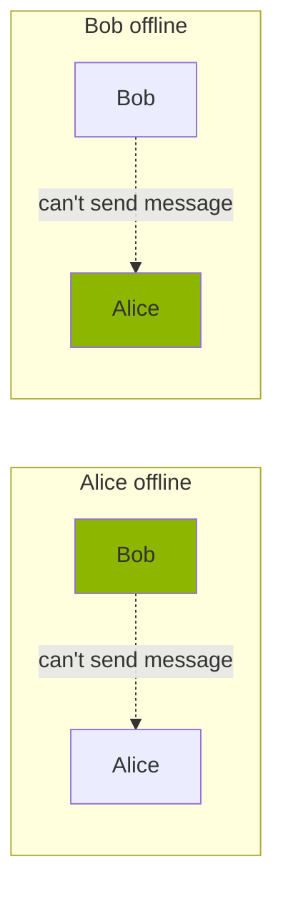
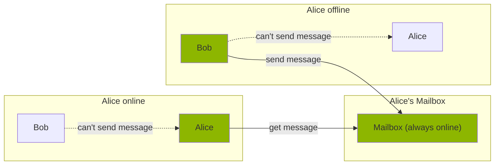

# AnonChatX Postbox

## What this is — and what it is not

AnonChatX Postbox exists to solve a real constraint of peer-to-peer systems
**without reintroducing centralized control**.

AnonChatX messages are exchanged directly between contacts.
There are no servers. No accounts. No global infrastructure.

That model maximizes privacy —
but it also means message delivery depends on **overlapping availability**.

In hostile, mobile, or unstable environments, that assumption does not hold.

Postbox exists to extend reachability **without betraying the threat model**.

It is not a platform.  
It is not a service.  
It is not a convenience layer owned by someone else.

It is user-controlled infrastructure.

---

## The problem: availability without centralization

Pure peer-to-peer messaging requires both parties to be online at the same time.

When one side is offline, messages stall — sometimes indefinitely.

This is not a bug.
It is the cost of refusing central servers.

But in mobile networks, under power constraints, or in high-risk conditions,
availability is inconsistent by default.

Postbox addresses this **without turning AnonChatX into a platform**.

---

## The solution: a postbox you control

AnonChatX Postbox is a **store-and-forward buffer** operated by the user,
not by a company or network operator.

It is:

- Always online (relative to a phone)
- Stable (home internet, fixed power)
- Reachable over Tor
- Owned and operated by the user

Contacts can leave encrypted messages for the postbox owner.
The owner retrieves them when they reconnect.

No global directory.  
No shared infrastructure.  
No third-party custody.

Postbox improves reachability **without creating a server worth seizing**.

---

## Threat-model alignment

Postbox is designed under the same assumptions as AnonChatX:

- Networks are monitored
- Traffic may be blocked or delayed
- Devices may be inspected
- Contacts may be compromised over time

As a result:

- All connections occur over **Tor**
- The Postbox has **no knowledge of message contents**
- The Postbox does **not establish identity**
- The Postbox does **not create accounts**
- The Postbox does **not become a hub**

If Postbox cannot be operated safely, it should not be operated at all.

---

## What Postbox deliberately does NOT do

Postbox is intentionally limited.

It does **not**:

- Act as a relay for arbitrary users
- Provide global reachability
- Maintain user directories
- Replace peer-to-peer delivery
- Introduce push services tied to third parties

Postbox exists to **extend availability**, not to recentralize communication.

---

## Hardware & deployment philosophy

Postbox is designed to be deployable with minimal friction
and minimal trust assumptions.

Initial target:

- **Android application**
- A spare phone
- Stable power
- Stable internet

No special hardware required.

Future deployments may include:

- GNU/Linux servers
- Raspberry Pi
- Any Java-capable environment

The operator always remains the owner.

---

## Features

### Core capabilities

- Contacts can store messages for the postbox owner
- The owner can store messages for contacts to retrieve later
- All communication occurs over Tor
- Messages remain end-to-end encrypted

### Extended / optional components

- Group message synchronization to increase message circulation
- Alternative transports (LAN, Wi-Fi Direct, Bluetooth)
- Push-like wake mechanisms to reduce phone battery drain

All extensions are evaluated against the threat model first.

---

This does not change the trust model.
It only changes the hardware.

---

## This infrastructure is not neutral

Postbox is not designed to serve platforms, institutions, or scale-seeking actors.

It is built for users who:

- Cannot rely on always-on connectivity
- Cannot afford centralized intermediaries
- Need availability **without surveillance**
- Operate under real constraints

If you are looking for convenience, there are easier tools.
If you are looking for control, this one makes trade-offs explicit.

---

## Donations

AnonChatX Postbox is developed independently.

If you support its existence, you can contribute financially:

**Monero:**  
`85kkMcowoNwQwji3ugetQvfwismWuvGWWLWfhWoyLjqnDAcgsnpVMsWG76zMm3zEb9WfUcJqBCKZKQ8wVox58tfr7dY7CXF`

Donations do not grant influence.

---

## License

This program is free software: you can redistribute it and/or modify it
under the terms of the **GNU Affero General Public License**, version 3 or later.

See [LICENSES/AGPL-3.0-or-later.txt](LICENSES/AGPL-3.0-or-later.txt).

This project is compliant with version 3.0 of the
[REUSE Specification](https://reuse.software).